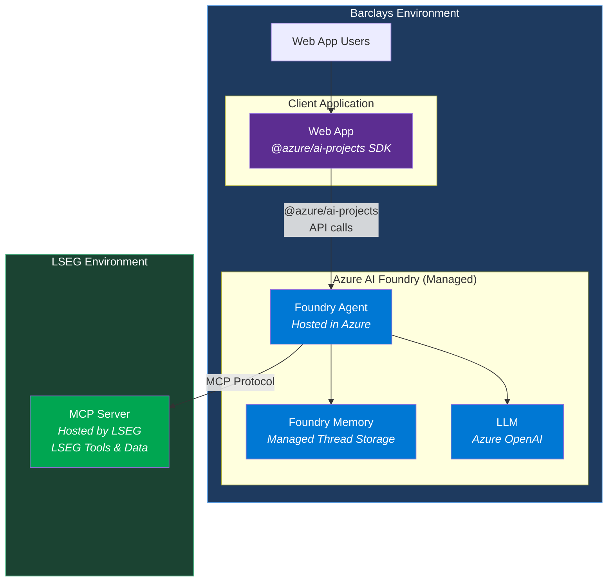
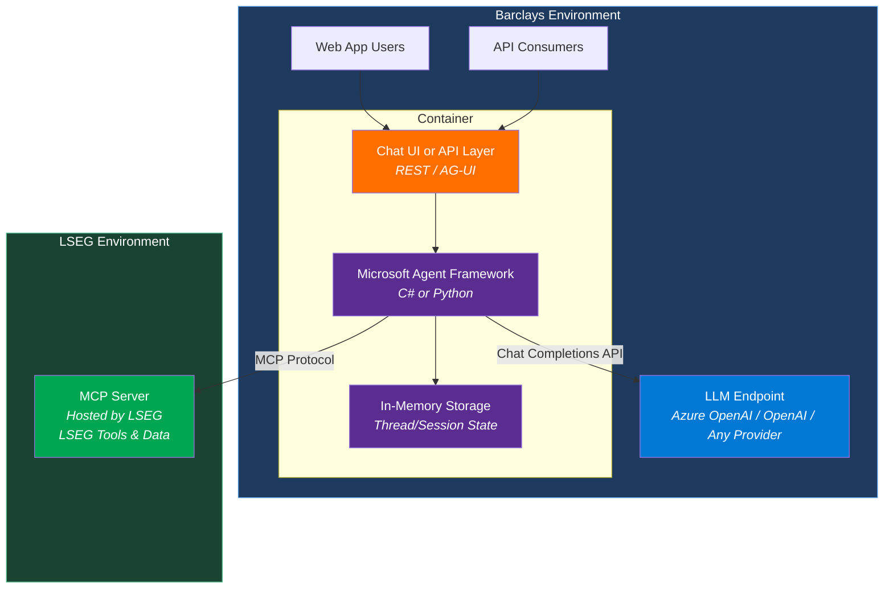
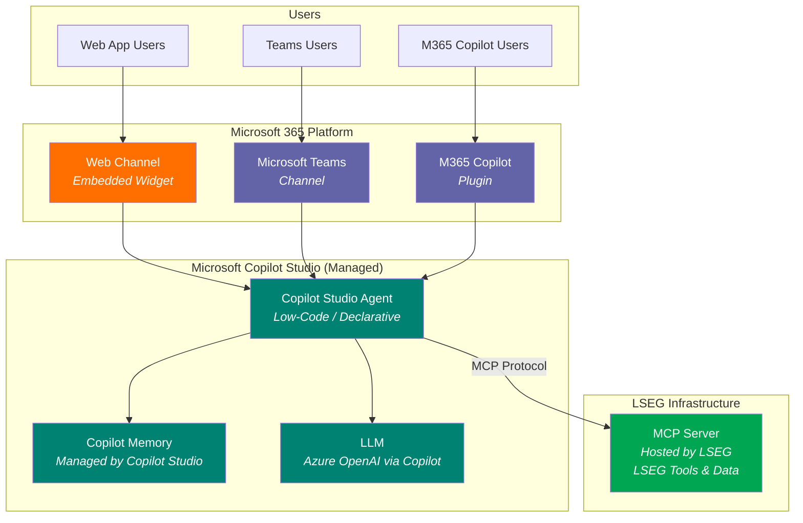
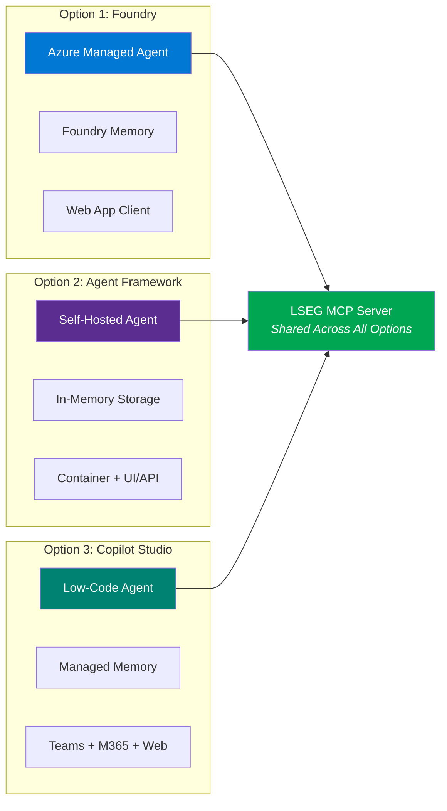

# Agent Architecture Options

## Option 1: Azure AI Foundry Agent (Managed)

**Key characteristics:**
- Azure manages agent runtime, memory, and LLM
- Web app is a thin client using `@azure/ai-projects` SDK
- MCP Server hosted/controlled by LSEG
- Minimal code, maximum Azure dependency

---

## Option 2: Microsoft Agent Framework (Self-Hosted)

**Key characteristics:**
- Self-hosted in a container — deploy anywhere
- Full control over agent logic, memory, and orchestration
- Built-in MCP client for LSEG tools
- Exposes UI or API (or both)
- C# or Python only (no TypeScript)

---

## Option 3: Copilot Studio (Low-Code, M365 Native)

**Key characteristics:**
- Low-code / no-code agent built in Copilot Studio
- Native deployment to Teams, M365 Copilot, and Web channel
- MCP Server connector for LSEG tools
- Fully managed by Microsoft — minimal infrastructure
- Least control, most convenience

---

## Side-by-Side Comparison

| | Option 1: Foundry | Option 2: Agent Framework | Option 3: Copilot Studio |
|---|---|---|---|
| **Agent hosting** | Azure managed | Self-hosted (container) | Microsoft managed |
| **Code required** | Thin client SDK calls | Full agent code (C#/Python) | Low-code / no-code |
| **Memory** | Foundry managed | In-memory (self-managed) | Copilot Studio managed |
| **MCP Server** | LSEG MCP ✅ | LSEG MCP ✅ | LSEG MCP ✅ |
| **LLM** | Azure OpenAI (Foundry) | Any provider | Azure OpenAI (Copilot) |
| **Teams/M365** | Needs Teams SDK layer | Needs Teams SDK layer | ✅ Native (built-in) |
| **Web App** | ✅ Via SDK | ✅ Via container UI/API | ✅ Via web channel |
| **TypeScript** | ✅ (client SDK) | ❌ C#/Python only | N/A (low-code) |
| **Portability** | Azure only | Any cloud / on-prem | Microsoft only |
| **Control** | Medium | Full | Low |
| **Complexity** | Low | Medium-High | Very Low |
| **Vendor lock-in** | High (Azure) | Low | High (Microsoft) |
